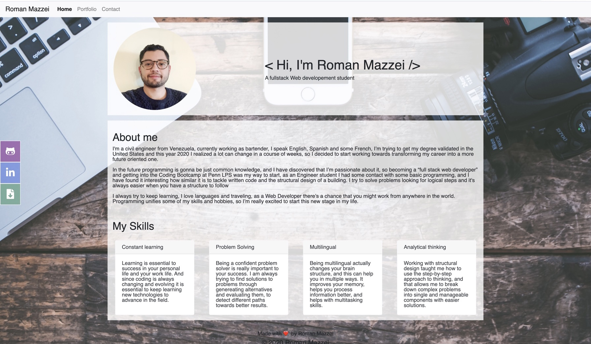
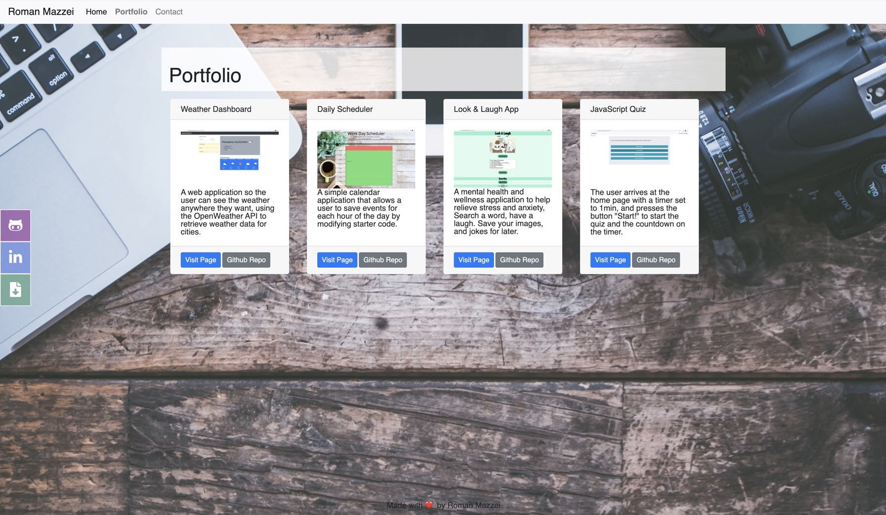
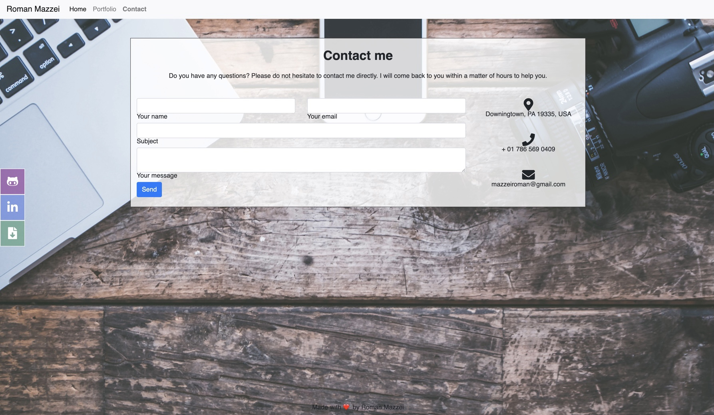

# mazzeiroman.github.io
## Link to the deployed website
https://mazzeiroman.github.io/

# Roman Mazzei Portfolio
This portfolio is a website to promote my work as a full stack web developement student in the coding bootcamp at Penn LPS, a collection of work samples that shows my capabilities to any prospective employer. 

>Home / About me.

>Portfolio.

>Contact.

## Files and Directories

```
index.html
portfolio.html
contact.html
README.md
>images (the directory contains all the images for the project)
```
## Bootstrap
   * A navbar

   * A responsive layout

   * Responsive images

   * Screenshots are provided in the `images folder`.

## Deployed Page




## Credits

© 2022 Roman Mazzei.

## license

Copyright © 2022 Roman Mazzei

Permission is hereby granted, free of charge, to any person obtaining a copy of
this software and associated documentation files (the "Software"), to deal in
the Software without restriction, including without limitation the rights to
use, copy, modify, merge, publish, distribute, sublicense, and/or sell copies
of the Software, and to permit persons to whom the Software is furnished to do
so, subject to the following conditions:

The above copyright notice and this permission notice shall be included in all
copies or substantial portions of the Software.

THE SOFTWARE IS PROVIDED "AS IS", WITHOUT WARRANTY OF ANY KIND, EXPRESS OR
IMPLIED, INCLUDING BUT NOT LIMITED TO THE WARRANTIES OF MERCHANTABILITY,
FITNESS FOR A PARTICULAR PURPOSE AND NONINFRINGEMENT. IN NO EVENT SHALL THE
AUTHORS OR COPYRIGHT HOLDERS BE LIABLE FOR ANY CLAIM, DAMAGES OR OTHER
LIABILITY, WHETHER IN AN ACTION OF CONTRACT, TORT OR OTHERWISE, ARISING FROM,
OUT OF OR IN CONNECTION WITH THE SOFTWARE OR THE USE OR OTHER DEALINGS IN THE
SOFTWARE.
