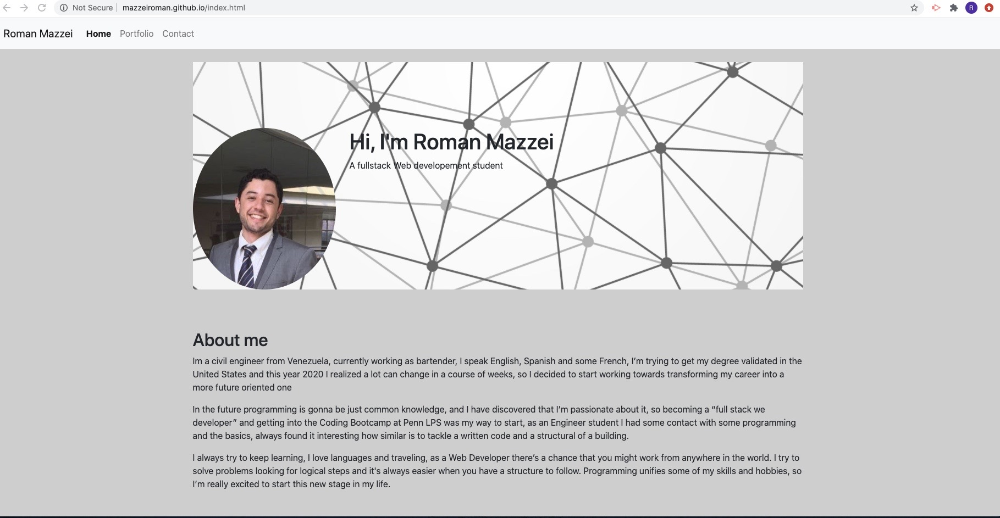

# mazzeiroman.github.io

# Roman Mazzei Portfolio
This portfolio is a website to promote my work as a full stack web developement student in the coding bootcamp at Penn LPS, a collection of work samples that shows my capabilities to any prospective employer. 

>Home / About me.

>Portfolio.

>Contact.

## Files and Directories

```
index.html
portfolio.html
contact.html
README.md
>images (the directory contains all the images for the project)
```
## Bootstrap
   * A navbar

   * A responsive layout

   * Responsive images

   * Screenshots are provided in the `images folder`.

## Link to the deployed website
https://mazzeiroman.github.io/index.htmlgit 



## Credits

© 2020 Roman Mazzei.
